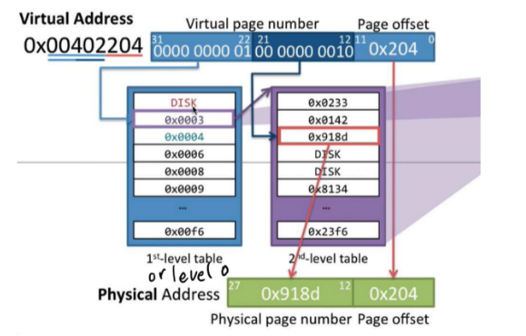

# Assignment #3 - Multilevel Pagetable w/ TLB

*CS 480 S1, Spring 2023 - Anthony Norderhaug, Anthony Contreras*

Due on **3/23/23 at 4:00 PM**, start of class

**note**: *trace* files are not included in repo due to size ~ download from Canvas

## Process

1. Create an empty page table at <u>level 0</u>

2. Read in virtual addresses from input *trace* file
   
   - Suppsoed to be simulating memory access attempts

3. Processing each virtual address...
   
   1. Extract VPN and search for *existing* VPN - PFN mapping in TLB
      
      1. If present, use found PFN
   
   2. If **NOT** present (i.e. TLB "miss"), <u>walk the page tree</u>
      
      
      
      1. Using the bits **per level** within the virtual address, extract the address for the NEXT page table and process its level's bits
      
      2. Repeat above until <u>leaf level reached</u>
      
      3. Once at *leaf level*, check if page has already been allocated 
         
         1. I.e. if the final indexed entry contains a PFN 
         
         2. If 'null', insert an int value that starts from 0

4. Once walking is finished, **insert the VPN - PFN mapping into the TLB**

5. Track and update accordingly the *most recently accessed pages*
   
   1. TLB has <u>a fixed size</u>, meaning our processed mappings may exceed it
   
   2. In this scenario, use **LRU Cache Replacement** to get rid of least accessed values
      
      1. LRU = "Least Recently Used"
      
      2. Updating...
         
         1. If mapping is in TLB, increment "cache hits"
         
         2. If mapping not in TLB but found in page table, increment "page table hits"
      
      3. Formula
         
         1. **TLB Cache Hits** + **PT Hits** + **PT Misses** = **Total # of Address Accesses**

## Tasks

- [ ] Implement reading of the trace file
- [ ] Implement converting hexadecimal virtual address into bits
- [ ] Implement PageTable structure, allocating new PageTable levels, and how to store addresses to sequential PageTables
- [ ] Implement sectioning off virtual addr.'s bits per each level per bitmasking and shifting right
- [ ] Implement virtual addr. processing and "walking" down to the leaf level
- [ ] Implement PFN allocation, starting from 0
- [ ] Implement TLB cache for storing VPN to PFN mappings
- [ ] Implement tracking for access frequency & LRU cache replacement
- [ ] Implement optional arguments specfiying bits per level, TLB cache size, & user-specified files
- [ ] Implement proper output printing using print_helpers()
